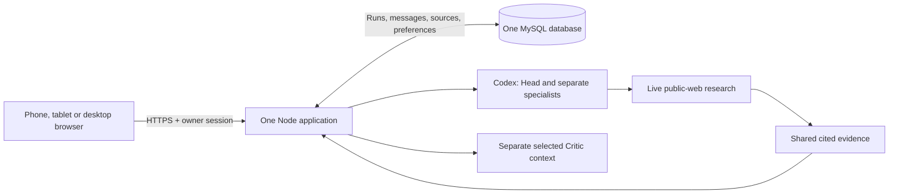

# Proposed architecture

Browser-voice reconciliation, 14 September 2026; Preview-activation reconciliation, 15 September 2026. The named GoDaddy app's Preview deployment and owned migration are observed. The deployed NanoDuck production-mode override takes precedence over host-owned development `NODE_ENV`; a private Chrome browser reached first-use consent and an existing private Safari session reached Settings, but fresh Google OAuth remains a separate verification. Publication, a real consultation and legacy-data erasure remain separate gates.

## One application with durable work

Serve the UI, Google owner login, consultation endpoints and bounded work coordinator from one Node application in the existing GoDaddy app. Retain the provider process adapters and subscription grants. MySQL stores the authoritative conversation and work state. Do not add Redis, a queue service, microservices, a separate AI host or another messenger.

Removing Matrix removes the Rust sidecar, encrypted-device lifecycle, transport-specific ingress/outbox, publication synchronization, NDJSON bridge and wake pusher. Obsolete Cloudflare-specific adapters do not enter this repository.

## Minimum persistence contract

- Accept a user message and create/advance its run in one transaction. A client request ID prevents duplicate acceptance after retries. A draft is not accepted work.
- A worker leases a run outside the HTTP request lifetime. Each completed agent message and next step commit atomically to one ordered event stream. Save role, recipient, actual body, model snapshot and source associations.
- The browser replays committed events after its last cursor. Prefer authenticated SSE; use authenticated incremental polling if the host buffers streams. No extra delivery outbox is needed because both read canonical events.
- Stop changes the run generation. A late provider response may commit only if its run generation and lease remain valid. No late final result after Stop.
- Restart resumes the last committed step. If a provider finished but no result committed, retry may repeat the model call. Promise one confirmed visible result per step, not exactly-once provider execution.

This contract is the essential reliability work for a phone browser. It must be tested on the chosen GoDaddy runtime before release.

## Agent and research contract

Head, every selected specialist and Critic receive a separate ephemeral model invocation. The server reconstructs each prompt from the canonical event stream: its assignment, the owner question, prior confirmed discussion and an output contract. One reviewable module, `src/server/prompt-contracts.mjs`, parses and renders behavioral sections from the single owner-visible Markdown document encrypted in the app database. A fresh database receives its first validated document only through a one-time deployment secret during migration; no instruction document is read from the repository at runtime. Each Settings save and restore creates an encrypted immutable version. At acceptance the run stores exact Markdown plus an opaque revision and content hash, so an edit or restore affects only later consultations; the provider receives that snapshot, never a mutable live document. For substantive work, Head chooses an Auto team through an internal routing invocation when needed, then emits only concise tasks addressed individually to the selected specialists. Each visible pre-conclusion Head task must satisfy a machine-checked task-only wrapper and repeat both a case anchor and a second detail from the owner's decision; malformed, owner-facing or generic Head prose triggers one corrective retry. Only if that retry fails does the system commit a concise, context-bound task that quotes the stated decision, never a static role template. The exact committed task is supplied explicitly to its selected specialist; other Head tasks are context only and must be ignored. Head gives no visible advice or position before the conclusion. Each specialist sends an independent initial position to Critic; the only subsequent role topology is Critic → relevant specialist → Critic for each selected exchange. Specialists never route work to each other. Head addresses the owner once, in the final synthesis. Every visible contribution has a role-specific prompt and maximum length; overlong provider prose is trimmed at a completed sentence. Prompts prohibit generic exposition and unsupported invented figures, market claims, customer behavior and sources, requiring an explicit missing condition when evidence is absent. The permitted pool excludes Leadership Consultant and esoteric roles. Spiritual Consultant receives the specified evangelical Protestant doctrine; Psychotherapist receives the specified classical-school/IFS capability and non-diagnosis, non-emergency boundary. They can reference full shared submitted messages and relevant evidence, not hidden reasoning. Address an actual disagreement to the relevant participant and let that participant answer it before synthesis.

Keep the current exact provider/model/effort settings and caps described in [model-settings.md](model-settings.md). Use structured internal envelopes only for routing, identity and work status. Natural language messages should not carry hashes, vote tables, procedural stages or artificial acknowledgments. The browser renders a restricted Markdown subset—paragraphs, headings, ordered/unordered lists, quotations, emphasis, inline code and public HTTPS links—through constructed DOM nodes. Raw HTML never executes; unsafe, private or prohibited-host links remain inert and are rejected at the accepted-message/provider boundary.

Enable the existing restricted Codex live-search path when decision-relevant research is needed. Keep filesystem, arbitrary shell, computer use and unrelated integrations disabled. A tool-free Claude Critic can submit a targeted research request to the coordinator; a Codex research-capable participant executes it and returns sources to the shared record. This is a team research path, not a claim that Claude's current adapter browses directly. Prompts restrict responses and research to English/Ukrainian; validation rejects Russian/Belarusian language markers and `.ru`, `.by`, `.su` or Cyrillic-equivalent hosts before source records are stored or rendered.

Store source title, direct URL, supported claim and retrieval/publication information. Treat retrieved content as untrusted data, minimize queries and never include credentials or private documents by default. Require English/Ukrainian source text and reject prohibited-language metadata at the same boundary as URL validation. A source failure or unsupported claim is visible as a limitation.

## Identity, grants and preferences

Retain the current Google identity boundary for the sole owner and secure server sessions, authorization and CSRF protection. App login protects application access; it does not authorize an AI subscription. Provider credentials remain server-only, encrypted with keys separated from database data. Verify supported renewal for the active route. Do not probe or require unused Claude access.

Before cutover, take a content-free saved-settings snapshot and verify the exact active tuples independently. Routine refresh should be automatic; revoked access gets one contextual reconnect action. Quota exhaustion gets reset/retry information. No automatic model downgrade or paid fallback.

## Data and product boundaries

Retain complete saved conversations, protected owner-generated image attachments, sources, settings, the owner's single private database-stored runtime-instructions document and run state. Whole-conversation export/delete are owner actions. Sanitize rendered model content and links. Keep public code separate from private runtime state. HTTPS and protected server storage replace the Matrix transport; do not claim device-to-device E2EE for this architecture.

The [deployment boundary](deployment-boundary.md) names the only allowed target. The source switch, Preview secrets, owned migration and encrypted instruction bootstrap are evidenced on that app; the Preview retains all nine legacy tables. The deployed production-mode override has reached private browser sessions, but a fresh Google callback has not yet been observed. Provider reauthorization/preflight, streaming behavior, a real consultation, browser voice, publication and legacy-data erasure remain release evidence to obtain.

## External capability references

Checked 13 September 2026: [Codex configuration](https://learn.chatgpt.com/docs/config-file/config-reference) documents web-search configuration; [Codex App Server](https://learn.chatgpt.com/docs/app-server) documents managed authentication; [Claude Code authentication](https://code.claude.com/docs/en/authentication) documents subscription authorization for supported automation. These describe mechanisms; they do not verify the owner's current grant, quota, model entitlement or hosting compatibility.

## Current drivers and source references

This reconciliation consumes the current PRD, context/terms, guardrails, journey, screen map, wireframes and combined-layout design brief with the selected Electric colour refinement and retained comparison references. The prior one-app/one-database proposal above remains. The owner now explicitly requires browser-native voice and functioning Settings selectors; no NanoDuck audio service, database record or provider change is added. Validated against `nanoduck-electric-a-v8-20260914`, the exact Electric A v8 target/tree and scope in the design brief. Its approval adds no service, database, role privilege or data exposure; the one-app architecture covers all nine surfaces and 44 states.

## Module and boundary map

| Boundary | Product obligations and local consequence |
|---|---|
| Browser shell | UC-001/UC-003/UC-005; FR-08.1–08.3, NFR-02.1–02.3. Responsive floating navigation, mobile disclosure, semantic controls, restricted DOM Markdown rendering for discussion/outcome content and no private persistent browser cache. |
| Composer and voice | UC-002/UC-006; FR-02.1–02.2, FR-07.1–07.5. Explicit Start → browser `SpeechRecognition` or `webkitSpeechRecognition` → Stop → editable draft → separate Send. Disclose the browser recognition-service boundary before Start; abort recognition on Cancel, background transition and close. |
| Identity/session boundary | UC-001; FR-01.1–01.2. Validate Google identity and server session before any private route, with first-use processing consent recorded separately. |
| Consultation coordinator and provider adapters | UC-002/UC-003; FR-02.3–02.8, FR-03.1–03.6, NFR-01.1–01.4. Separate role contexts, directed message exchange, exact settings plus runtime-instructions Markdown/revision snapshot, bounded continuation and durable Stop. |
| Research evidence path | UC-007; FR-04.1–04.3. Restricted Codex live search, targeted team requests, validated direct sources and explicit failure/uncertainty. |
| Settings/catalog | UC-005; FR-05.1–05.6. Validate provider/model/effort against refreshed supported catalog; validate, encrypt and save the owner-visible runtime-instructions Markdown document only when its loaded revision still matches; expose encrypted version metadata and review/restore; never change active-run snapshots. |
| Record store/export/delete | UC-004; FR-06.1–06.3. Owner-scoped complete history, safe exports, transactional deletion decisions and protected attachments. |

## Data and state model

Use the single existing database boundary for owner sessions, consent, preferences, the single owner-visible encrypted runtime-instructions Markdown document and encrypted version history, conversations, runs, ordered messages, evidence and image-attachment metadata/content references. Foreign keys or equivalent transactional checks bind every private record to the sole owner and conversation. The database migration may bootstrap an empty instruction record only from the deployment secret and preserves existing encrypted storage on restart. A run snapshots provider/model/effort/preset plus validated runtime-instructions Markdown/revision and content hash, and holds a generation, lease and committed-step cursor; message acceptance IDs and step IDs are unique in their applicable scope.

Image intake accepts only the authenticated owner's JPEG, PNG or WebP image at most 8 MiB. Enforce the byte cap while reading the request, ignore client MIME, then verify the matching binary signature before the blob enters encrypted storage. Store the opaque original with an internal identifier and validated type; do not execute, transcode, thumbnail, inspect embedded metadata or render it server-side. Any retrieval is owner-authorized and uses the fixed validated type, `Content-Disposition: attachment` and `X-Content-Type-Options: nosniff`. PDF, SVG, video, audio, archives and every other type fail before persistence. The owner's statement that they use only self-generated images is a declared threat boundary, not evidence that the server can prove provenance. There is no scanner service in this Node.js Hosting architecture. If the product permits another user, an external image source or a type outside JPEG/PNG/WebP, return this change to PRD security review before implementation.

Voice stores no audio in NanoDuck. The browser detects standard `SpeechRecognition` or WebKit-prefixed `webkitSpeechRecognition`, selects `uk-UA` when the browser presents Ukrainian, and retains only recognized text in page memory until the owner uses it and separately Sends. No `MediaRecorder`, audio blob, transcription endpoint, WebRTC path, new provider, key or model setting is introduced. Browser recognition is an external service boundary disclosed before Start; Cancel, error, completion, close and background transition stop or abort recognition. Unsupported browsers, disabled services, permission, language and network failure retain the typed draft and leave typing usable.

## Configuration and binding contract

The configuration contract uses `NANODUCK_RUNTIME_MODE`, `APP_ORIGIN`, `GOOGLE_CLIENT_ID`, `GOOGLE_CLIENT_SECRET`, `OWNER_GOOGLE_SUBJECT` or a verified owner email, `DATABASE_URL` or GoDaddy's injected `DB_*`, optional `DATABASE_SSL_CA_PATH`, `DATA_ENCRYPTION_KEY`, `RECOVERY_ENCRYPTION_KEY`, `SESSION_SIGNING_KEY`, `SESSION_ABSOLUTE_SECONDS`, `MAX_ATTACHMENT_BYTES`, one Codex auth source (`CODEX_APP_SERVER_AUTH_PATH`, `CODEX_APP_SERVER_AUTH_B64` or `CODEX_APP_SERVER_AUTH_GZIP_B64`) and a one-time instruction bootstrap only on a fresh database. `NANODUCK_RUNTIME_MODE` takes precedence where the host reserves `NODE_ENV`; Preview uses the production value while Published will receive its own production configuration. Preview has the host-appropriate values by name, never by value, and its `APP_ORIGIN` is the Preview host. Published must receive its own published origin; do not synchronize Preview's origin blindly. Application and migration startup require certificate verification; a mounted private CA is used where the host does not chain to a system trust root. Secrets stay server-side; key material is not stored beside ciphertext. Architecture maps the PRD 24-hour session behavior to `SESSION_ABSOLUTE_SECONDS=86400`. Persist issued-at/expiry and revocation server-side, and use a persistent cookie capped to the same absolute deadline so browser reopening retains normal access; activity never extends that deadline. No inactivity timer is configured. Never commit secret values or expose credentials in Settings.

Runtime remains one Node application plus the existing isolated provider subprocesses, targeting the observed GoDaddy Node 22 capability until reverified. Keep the provider package pins in the model record. Build outputs must contain only application assets/server artifacts and required runtime dependencies; exclude private records, `.git`, specifications, debug routes and local review helpers. The design preview uses static files and has no production deployment configuration.

## Security enforcement map

| PRD obligation | Mechanism and enforcement / evidence owner |
|---|---|
| NFR-10.1 | OIDC callback validates issuer/subject/audience/signature/lifetime/state/nonce and code flow; allowlist the configured owner. The implementation owner verifies Google's assurance behavior and source-documented fallback without an app MFA feature or compliance claim. |
| NFR-10.2 | Server-side session records, cryptographically random cookies, renewal, expiry and revocation; reauthenticated session-control action. Apply the PRD 24-hour inactivity/absolute boundary, persistent cookie and server deadline; reject at expiry or earlier explicit termination. Define concurrency and federated termination handling before session acceptance tests. |
| NFR-10.3 | Shared server authorization on every private read/mutation, attachment/export and run command; immutable fields are rejected rather than trusted from browser payloads. |
| NFR-11.1 | Typed request envelopes; constructed-DOM rendering of a restricted Markdown subset; inert raw HTML/unsafe links; English/Ukrainian-only message/source metadata validation; allowlisted HTTPS URLs; parameterized queries and provider process arguments. No eval/template execution from user/model content. |
| NFR-11.2 | Atomic idempotent acceptance, unique step commit, generation fencing and leases; bounded upload/research requests and inherited run ceilings. Browser voice does not call the trusted service until the owner separately Sends. |
| NFR-11.3 | Secure host-only HttpOnly cookies, appropriate SameSite and CSRF verification; restrictive CSP/MIME/nosniff/HSTS/referrer rules; exact origin and trusted proxy configuration. |
| NFR-12.1 | Egress allowlist and network/address/redirect validation for server fetches; deny local/metadata/private targets and prohibited Russian/Belarusian hosts including `.ru`, `.by`, `.su` and Cyrillic equivalents. Retrieved text cannot modify trusted tool scope. |
| NFR-12.2 | Enforce the 8 MiB streaming cap and JPEG/PNG/WebP binary-signature match; reject PDF/SVG/video/audio/archive/mismatch/truncation before persistence. Treat an accepted blob as opaque, encrypted non-executable data with internal naming, owner-only attachment disposition and `nosniff`; no parser, transform, preview or malware scanner runs in the managed Node.js host. The owner-only/self-generated-image boundary is explicit but is not provenance proof. Format/type/size rejection and protected retrieval must be proven before release. |
| NFR-12.3 | Separate trusted system instructions from submitted/retrieved material; permit only scoped research; no shell/computer tools or paid/model fallback. Require specific permission at any new sensitive/external-action boundary. |
| NFR-13.1 | Authenticated encryption with maintained primitives, key IDs/rotation, separated keys and tamper checks; isolated recovery proves restore without exposing grants. |
| NFR-13.2 | Verified HTTPS/TLS and service certificates; least-privilege app-specific database/provider identities. Actual host TLS and credential isolation must be verified before runtime acceptance. |
| NFR-14.1 | Classify records by private content, credentials, settings and metadata; minimize provider/search payloads; no trackers, content-bearing URLs or sensitive logs. |
| NFR-14.2 | No-store private responses; page-memory drafts; clear client content on sign-out; stop or abort browser recognition under the explicit lifecycle above. NanoDuck receives no voice audio. |
| NFR-14.3 | Encrypted indefinite confirmed history until deletion; durable deletion decisions applied to restores; isolated encrypted backup/restore with documented retention and recovery objectives. Never reintroduce deleted records after restore. |
| NFR-15.1 | Pinned dependencies/inventory and supported runtime; explicit target app/database ownership; publish only required artifacts; post-deploy inspection and scoped rollback. |
| NFR-16.1 | Structured event metadata with timestamps/run correlation, redacted content and escaped untrusted fields; protected operational copy for diagnosis with owner-defined retention/access. |
| NFR-16.2 | Fail-closed authorization/validation/commit paths and concise categorized errors; preserve confirmed work across provider/research/storage failures and test safe retry. |

## Architecture decisions, operations and risks

The earlier messenger-removal and single-store decisions remain. Voice adds a browser recognition-service boundary, not a NanoDuck audio service or a general-purpose integration. Dynamic Settings uses provider-specific capabilities and retains independent branch preferences. A selected Claude route with unavailable capability evidence remains explicitly unavailable; it never silently falls back.

Operational responsibility belongs to the product owner and the later authorized implementation operator, not to a fictional support team. Before production release they must record actual session/resource configuration, recovery objectives, backup/deletion propagation, incident access and risk-based dependency remediation timing. Performance measurement uses the existing product targets and subscription ceilings, not an invented availability SLA. Restore must run in isolation and must not touch another GoDaddy app. The provider receives the protected Codex `auth.json` through a mounted secret file where available or its base64url bytes from the host secret store; it writes the file only to each ephemeral app-server home and deletes that home after use. This is an operator provisioning boundary, never a Settings or routine owner action.

Electric A v8 is now the approved presentation baseline; unchosen B/C are retained references. Any approved voice, data-exposure or control-flow change is reconciled through the PRD/architecture before planning. Owner-confirmed Safari/Chrome Ukrainian probing establishes the selected desktop mechanism; mobile Safari and Android Chrome recognition, current provider authorization, a real consultation and GoDaddy lifecycle/storage/streaming beyond the observed restart/migration remain named release evidence gaps. The successful Preview deployment is limited evidence, not a published-release claim.

## Additional external capability references

Checked 14 September 2026: the [Chrome Web Speech demo](https://www.google.com/intl/en/chrome/demos/speech.html) includes `uk-UA`, and [WebKit's Safari announcement](https://webkit.org/blog/11648/new-webkit-features-in-safari-14-1/) documents Siri-backed Web Speech recognition. The owner confirmed a Ukrainian local probe in both current Safari and Chrome. These sources select the browser-native mechanism; mobile release validation remains required.
