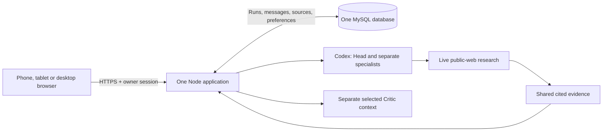

# Proposed architecture

Design-stage proposal, 13 September 2026. Production implementation is not authorized in this phase.

## One application with durable work

Serve the UI, Google owner login, consultation endpoints and bounded work coordinator from one Node application in the existing GoDaddy app. Retain the provider process adapters and subscription grants. MySQL stores the authoritative conversation and work state. Do not add Redis, a queue service, microservices, a separate AI host or another messenger.

Removing Matrix removes the Rust sidecar, encrypted-device lifecycle, transport-specific ingress/outbox, publication synchronization, NDJSON bridge and wake pusher. Obsolete Cloudflare-specific adapters do not enter this repository.

## Minimum persistence contract

- Accept a user message and create/advance its run in one transaction. A client request ID prevents duplicate acceptance after retries. A draft is not accepted work.
- A worker leases a run outside the HTTP request lifetime. Each completed agent message and next step commit atomically to one ordered event stream. Save role, recipient, actual body, model snapshot and source associations.
- The browser replays committed events after its last cursor. Prefer authenticated SSE; use authenticated incremental polling if the host buffers streams. No extra delivery outbox is needed because both read canonical events.
- Stop changes the run generation. A late provider response may commit only if its run generation and lease remain valid. No late final result after Stop.
- Restart resumes the last committed step. If a provider finished but no result committed, retry may repeat the model call. Promise one confirmed visible result per step, not exactly-once provider execution.

This contract is the essential reliability work for a phone browser. It must be tested on the chosen GoDaddy runtime before release.

## Agent and research contract

Head, every selected specialist and Critic receive separate persistent contexts. Specialists receive different assignments. They can reference full shared submitted messages and relevant evidence, not hidden reasoning. Address an actual disagreement to the relevant participant and let that participant answer it before synthesis.

Keep the current exact provider/model/effort settings and caps described in [model-settings.md](model-settings.md). Use structured internal envelopes only for routing, identity and work status. Natural language messages should not carry hashes, vote tables, procedural stages or artificial acknowledgments.

Enable the existing restricted Codex live-search path when decision-relevant research is needed. Keep filesystem, arbitrary shell, computer use and unrelated integrations disabled. A tool-free Claude Critic can submit a targeted research request to the coordinator; a Codex research-capable participant executes it and returns sources to the shared record. This is a team research path, not a claim that Claude's current adapter browses directly.

Store source title, direct URL, supported claim and retrieval/publication information. Treat retrieved content as untrusted data, minimize queries and never include credentials or private documents by default. A source failure or unsupported claim is visible as a limitation.

## Identity, grants and preferences

Retain the current Google identity boundary for the sole owner and secure server sessions, authorization and CSRF protection. App login protects application access; it does not authorize an AI subscription. Provider credentials remain server-only, encrypted with keys separated from database data. Verify supported renewal for the active route. Do not probe or require unused Claude access.

Before cutover, take a content-free saved-settings snapshot and verify the exact active tuples independently. Routine refresh should be automatic; revoked access gets one contextual reconnect action. Quota exhaustion gets reset/retry information. No automatic model downgrade or paid fallback.

## Data and product boundaries

Retain complete saved conversations, protected attachments, sources, settings and run state. Whole-conversation export/delete are owner actions. Sanitize rendered model content and links. Keep public code separate from private runtime state. HTTPS and protected server storage replace the Matrix transport; do not claim device-to-device E2EE for this architecture.

The [deployment boundary](deployment-boundary.md) names the only allowed target. Database/table ownership, runtime lifecycle, storage durability, streaming behavior and provider reauthorization remain implementation evidence to obtain. No migration scripts or backend stubs are included at this stage.

## External capability references

Checked 13 September 2026: [Codex configuration](https://learn.chatgpt.com/docs/config-file/config-reference) documents web-search configuration; [Codex App Server](https://learn.chatgpt.com/docs/app-server) documents managed authentication; [Claude Code authentication](https://code.claude.com/docs/en/authentication) documents subscription authorization for supported automation. These describe mechanisms; they do not verify the owner's current grant, quota, model entitlement or hosting compatibility.

## Current drivers and source references

This reconciliation consumes the current PRD, context/terms, guardrails, journey, screen map, wireframes and combined-layout design brief with three agent-colour palettes. The prior one-app/one-database proposal above remains. The owner now explicitly requires voice and functioning Settings selectors; no production source is added. There is no approved baseline yet, so approved-design reconciliation remains a later pass.

## Module and boundary map

| Boundary | Product obligations and local consequence |
|---|---|
| Browser shell | UC-001/UC-003/UC-005; FR-08.1–08.3, NFR-02.1–02.3. Responsive floating navigation, mobile disclosure, semantic controls and no private persistent browser cache. |
| Composer and voice | UC-002/UC-006; FR-02.1–02.2, FR-07.1–07.5. Explicit capture → stop → server transcription → editable draft → separate send. Release media tracks on cancel, background transition and completion. |
| Identity/session boundary | UC-001; FR-01.1–01.2. Validate Google identity and server session before any private route, with first-use processing consent recorded separately. |
| Consultation coordinator and provider adapters | UC-002/UC-003; FR-02.3–02.8, FR-03.1–03.6, NFR-01.1–01.4. Separate role contexts, directed message exchange, exact settings snapshot, bounded continuation and durable Stop. |
| Research evidence path | UC-007; FR-04.1–04.3. Restricted Codex live search, targeted team requests, validated direct sources and explicit failure/uncertainty. |
| Settings/catalog | UC-005; FR-05.1–05.5. Validate provider/model/effort against refreshed supported catalog, save future preferences atomically and never change active-run tuples. |
| Record store/export/delete | UC-004; FR-06.1–06.3. Owner-scoped complete history, safe exports, transactional deletion decisions and protected attachments. |

## Data and state model

Use the single existing database boundary for owner sessions, consent, preferences, conversations, runs, ordered messages, evidence and attachment metadata/content references. Foreign keys or equivalent transactional checks bind every private record to the sole owner and conversation. A run snapshots provider/model/effort/preset and holds a generation, lease and committed-step cursor; message acceptance IDs and step IDs are unique in their applicable scope.

Temporary audio is a separate short-lived input, not a permanent conversation attachment. Prefer browser `getUserMedia` and `MediaRecorder` with runtime MIME negotiation; verify each produced format against the existing Codex native-audio/transcription adapter before deciding any conversion. No WebRTC calling, browser speech-service dependency, extra paid transcription provider or new LLM selection is assumed. Server-side transcription uses only the verified allowed subscription path. Audio is erased on cancel/failure/completed transcription; editable text remains an unsent page-memory draft until explicit Send. If compatibility fails, keep typing available and treat voice as an unresolved release requirement.

## Configuration and binding contract

Proposed deployment configuration names below are a boundary contract, not claims that they already exist in GoDaddy: `APP_ORIGIN`, `GOOGLE_CLIENT_ID`, `GOOGLE_CLIENT_SECRET`, `OWNER_GOOGLE_SUBJECT`, `DATABASE_URL`, `DATA_ENCRYPTION_KEY`, `SESSION_IDLE_SECONDS`, `SESSION_ABSOLUTE_SECONDS`, `MAX_ATTACHMENT_BYTES`, `MAX_AUDIO_SECONDS`. Secrets stay server-side; key material is not stored beside ciphertext. Architecture maps the PRD 24-hour session behavior to `SESSION_IDLE_SECONDS=86400` and `SESSION_ABSOLUTE_SECONDS=86400`. Persist issued-at/expiry and revocation server-side, and use a persistent cookie capped to the same absolute deadline so browser reopening retains normal access; activity never extends that deadline. Resolve other values and host mapping in implementation preflight. Never commit secret values or expose credentials in Settings.

Runtime remains one Node application plus the existing isolated provider subprocesses, targeting the observed GoDaddy Node 22 capability until reverified. Keep the provider package pins in the model record. Build outputs must contain only application assets/server artifacts and required runtime dependencies; exclude private records, `.git`, specifications, debug routes and local review helpers. The design preview uses static files and has no production deployment configuration.

## Security enforcement map

| PRD obligation | Mechanism and enforcement / evidence owner |
|---|---|
| NFR-10.1 | OIDC callback validates issuer/subject/audience/signature/lifetime/state/nonce and code flow; allowlist the configured owner. The implementation owner verifies Google's assurance behavior and source-documented fallback without an app MFA feature or compliance claim. |
| NFR-10.2 | Server-side session records, cryptographically random cookies, renewal, expiry and revocation; reauthenticated session-control action. Apply the PRD 24-hour inactivity/absolute boundary, persistent cookie and server deadline; reject at expiry or earlier explicit termination. Define concurrency and federated termination handling before session acceptance tests. |
| NFR-10.3 | Shared server authorization on every private read/mutation, attachment/export and run command; immutable fields are rejected rather than trusted from browser payloads. |
| NFR-11.1 | Typed request envelopes, safe text/Markdown rendering, allowlisted URL schemes, parameterized queries and provider process arguments; no eval/template execution from user/model content. |
| NFR-11.2 | Atomic idempotent acceptance, unique step commit, generation fencing and leases; bounded upload/audio/research requests and inherited run ceilings. The implementation owner sets resource limits from actual provider/runtime capacity. |
| NFR-11.3 | Secure host-only HttpOnly cookies, appropriate SameSite and CSRF verification; restrictive CSP/MIME/nosniff/HSTS/referrer rules; exact origin and trusted proxy configuration. |
| NFR-12.1 | Egress allowlist and network/address/redirect validation for server fetches; deny local/metadata/private targets. Retrieved text cannot modify trusted tool scope. |
| NFR-12.2 | MIME/content validation, isolated non-executable storage, resource-limited parsers and malware checks before processing/download; choose a compatible local or existing mechanism within the same app, with no added paid scanner assumed. Format/size policy must be proven before release. |
| NFR-12.3 | Separate trusted system instructions from submitted/retrieved material; permit only scoped research/transcription; no shell/computer tools or paid/model fallback. Require specific permission at any new sensitive/external-action boundary. |
| NFR-13.1 | Authenticated encryption with maintained primitives, key IDs/rotation, separated keys and tamper checks; isolated recovery proves restore without exposing grants. |
| NFR-13.2 | Verified HTTPS/TLS and service certificates; least-privilege app-specific database/provider identities. Actual host TLS and credential isolation must be verified before runtime acceptance. |
| NFR-14.1 | Classify records by private content, credentials, settings and metadata; minimize provider/search payloads; no trackers, content-bearing URLs or sensitive logs. |
| NFR-14.2 | No-store private responses; page-memory drafts; clear client content on sign-out; release capture and erase temporary audio under the explicit lifecycle above. |
| NFR-14.3 | Encrypted indefinite confirmed history until deletion; durable deletion decisions applied to restores; isolated encrypted backup/restore with documented retention and recovery objectives. Never reintroduce deleted records after restore. |
| NFR-15.1 | Pinned dependencies/inventory and supported runtime; explicit target app/database ownership; publish only required artifacts; post-deploy inspection and scoped rollback. |
| NFR-16.1 | Structured event metadata with timestamps/run correlation, redacted content and escaped untrusted fields; protected operational copy for diagnosis with owner-defined retention/access. |
| NFR-16.2 | Fail-closed authorization/validation/commit paths and concise categorized errors; preserve confirmed work across provider/research/storage failures and test safe retry. |

## Architecture decisions, operations and risks

The earlier messenger-removal and single-store decisions remain. Voice adds a browser capture/transcription input boundary, not a new general-purpose service. Dynamic Settings uses provider-specific capabilities and retains independent branch preferences. A selected Claude route with unavailable capability evidence remains explicitly unavailable; it never silently falls back.

Operational responsibility belongs to the product owner and the later authorized implementation operator, not to a fictional support team. Before production release they must record actual session/resource configuration, recovery objectives, backup/deletion propagation, incident access and risk-based dependency remediation timing. Performance measurement uses the existing product targets and subscription ceilings, not an invented availability SLA. Restore must run in isolation and must not touch another GoDaddy app.

The choice among A/B/C changes presentation. Any approved voice, data-exposure or control-flow change is reconciled through the PRD/architecture before planning. Unverified settings, exact audio compatibility, provider authorization and GoDaddy lifecycle/storage/streaming remain named implementation evidence gaps. They do not prove a blocked or successful deployment because none is attempted in this phase.

## Additional external capability references

Checked 13 September 2026: [MediaRecorder](https://developer.mozilla.org/en-US/docs/Web/API/MediaRecorder) provides recording and MIME support detection; [getUserMedia](https://developer.mozilla.org/en-US/docs/Web/API/MediaDevices/getUserMedia) defines browser media permission/access. These APIs inform the proposal, not a claim that recorded browser formats already work with the deployed transcription adapter.
