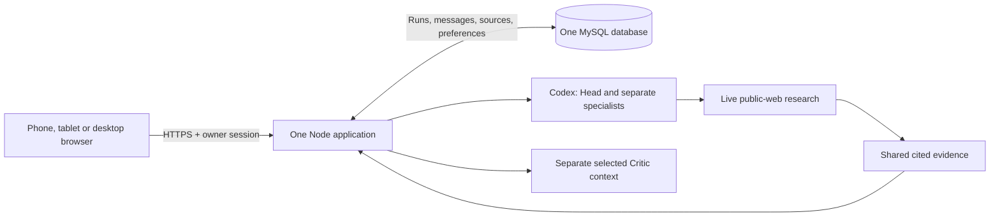

# Proposed architecture

Design-stage proposal, 13 September 2026. Production implementation is not authorized in this phase.

## One application with durable work

Serve the UI, Google owner login, consultation endpoints and bounded work coordinator from one Node application in the existing GoDaddy app. Retain the provider process adapters and subscription grants. MySQL stores the authoritative conversation and work state. Do not add Redis, a queue service, microservices, a separate AI host or another messenger.

Removing Matrix removes the Rust sidecar, encrypted-device lifecycle, transport-specific ingress/outbox, publication synchronization, NDJSON bridge and wake pusher. Obsolete Cloudflare-specific adapters do not enter this repository.

## Minimum persistence contract

- Accept a user message and create/advance its run in one transaction. A client request ID prevents duplicate acceptance after retries. A draft is not accepted work.
- A worker leases a run outside the HTTP request lifetime. Each completed agent message and next step commit atomically to one ordered event stream. Save role, recipient, actual body, model snapshot and source associations.
- The browser replays committed events after its last cursor. Prefer authenticated SSE; use authenticated incremental polling if the host buffers streams. No extra delivery outbox is needed because both read canonical events.
- Stop changes the run generation. A late provider response may commit only if its run generation and lease remain valid. No late final result after Stop.
- Restart resumes the last committed step. If a provider finished but no result committed, retry may repeat the model call. Promise one confirmed visible result per step, not exactly-once provider execution.

This contract is the essential reliability work for a phone browser. It must be tested on the chosen GoDaddy runtime before release.

## Agent and research contract

Head, every selected specialist and Critic receive separate persistent contexts. Specialists receive different assignments. They can reference full shared submitted messages and relevant evidence, not hidden reasoning. Address an actual disagreement to the relevant participant and let that participant answer it before synthesis.

Keep the current exact provider/model/effort settings and caps described in [model-settings.md](model-settings.md). Use structured internal envelopes only for routing, identity and work status. Natural language messages should not carry hashes, vote tables, procedural stages or artificial acknowledgments.

Enable the existing restricted Codex live-search path when decision-relevant research is needed. Keep filesystem, arbitrary shell, computer use and unrelated integrations disabled. A tool-free Claude Critic can submit a targeted research request to the coordinator; a Codex research-capable participant executes it and returns sources to the shared record. This is a team research path, not a claim that Claude's current adapter browses directly.

Store source title, direct URL, supported claim and retrieval/publication information. Treat retrieved content as untrusted data, minimize queries and never include credentials or private documents by default. A source failure or unsupported claim is visible as a limitation.

## Identity, grants and preferences

Retain the current Google identity boundary for the sole owner and secure server sessions, authorization and CSRF protection. App login protects application access; it does not authorize an AI subscription. Provider credentials remain server-only, encrypted with keys separated from database data. Verify supported renewal for the active route. Do not probe or require unused Claude access.

Before cutover, take a content-free saved-settings snapshot and verify the exact active tuples independently. Routine refresh should be automatic; revoked access gets one contextual reconnect action. Quota exhaustion gets reset/retry information. No automatic model downgrade or paid fallback.

## Data and product boundaries

Retain complete saved conversations, protected attachments, sources, settings and run state. Whole-conversation export/delete are owner actions. Sanitize rendered model content and links. Keep public code separate from private runtime state. HTTPS and protected server storage replace the Matrix transport; do not claim device-to-device E2EE for this architecture.

The [deployment boundary](deployment-boundary.md) names the only allowed target. Database/table ownership, runtime lifecycle, storage durability, streaming behavior and provider reauthorization remain implementation evidence to obtain. No migration scripts or backend stubs are included at this stage.

## External capability references

Checked 13 September 2026: [Codex configuration](https://learn.chatgpt.com/docs/config-file/config-reference) documents web-search configuration; [Codex App Server](https://learn.chatgpt.com/docs/app-server) documents managed authentication; [Claude Code authentication](https://code.claude.com/docs/en/authentication) documents subscription authorization for supported automation. These describe mechanisms; they do not verify the owner's current grant, quota, model entitlement or hosting compatibility.
