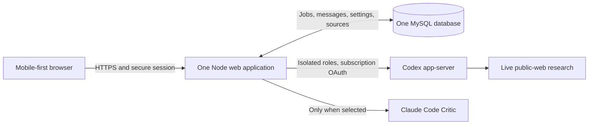

# Architecture review — browser replacement

Review date: 13 September 2026. Reviewer: Architecture Reviewer. Scope: read-only review of the old repository and a proposed architecture; no implementation, deployment, database access or cleanup.

## Decision

Use one mobile-first web interface, one Node application, one MySQL database and the existing subscription-backed provider adapters. Preserve separate real consultant/Critic contexts and durable conversation work. Remove the entire Matrix/Rust transport subsystem. Store one ordered conversation record that both the browser and orchestrator consume.

The current architecture contains useful protections, but many protect a messenger transport that the new product no longer needs. Replacing the UI alone would retain most failure surfaces. Rebuilding without durable jobs would create a different reliability problem when a mobile browser disconnects.

This is an architecture proposal for the brief/design phase, not an implementation authorization.

## Evidence scope

Source repository: `Ingwarski/personal-ai-consulting-group-godaddy`, inspected commit `49c7ad9a0b3033e9437e79cd98ed5d35e71cfced`; working tree was clean at inspection. All `path:line` references below refer to that commit unless identified as a historical report. Source tree: [GitHub](https://github.com/Ingwarski/personal-ai-consulting-group-godaddy/tree/49c7ad9a0b3033e9437e79cd98ed5d35e71cfced).

Reviewed architecture, runtime composition, MySQL adapters, Matrix service/supervisor interfaces, registrar, consensus router, provider configuration, model catalog, subscription authentication, research fence and relevant historical verification reports. This is a targeted architecture review, not an exhaustive security audit or live deployment test. Repository facts and historical incident evidence do not establish the current Published revision, provider selection, entitlement or database condition.

## Verified complexity and failure mechanisms

| Finding | Evidence | Implication for the replacement |
|---|---|---|
| The product is composed around two surfaces and an additional message transport. | `docs/architecture.md:144–160` specifies Element → Matrix → Rust sidecar → Node → MySQL/provider processes, with browser Settings separately authenticated. `src/godaddy/application-runtime.ts:131–187` actually composes registrar, Matrix outbox, encrypted media consumer, transport service, worker leadership and consultation service. | A browser removes the external message transport, homeserver dependency, device trust, Rust process, NDJSON bridge, Matrix media staging, messenger delivery projection and wake plumbing. |
| Core persistence is coupled to messenger delivery. | `src/godaddy/registrar-runtime.ts:40–55` wires confirmed messages directly into MySQL Matrix outbox projection and generation fences. `src/godaddy/application-runtime.ts:173–186` binds consultation execution to Matrix ingress receipts, room identity and Matrix readiness. | Introduce a transport-neutral ordered conversation event record. The browser reads it directly. Retain durable jobs, message identity, transactional append and cancellation generations. |
| A healthy HTTP app is not evidence of a usable consultation. | Only production with valid DB settings starts the application (`src/godaddy/application-runtime.ts:94–125`); setup flags and Matrix readiness can independently suppress startup (`:194–199`). The worker separately checks transport readiness, leadership, recovery, ingress leases and state (`src/godaddy/matrix-consultation-service.ts:840–877`). | Keep readiness internally, but the ordinary user should receive a specific recoverable error only when consultation work cannot proceed. Do not expose the setup machinery as the normal app experience. |
| Repair history has accumulated inside the governing architecture. | AD-26 says it supersedes selected SQLite/OS-lock/no-Rust-MySQL statements (`docs/architecture.md:9–17`), while the main diagram and module table still show the older SQLite/no-MySQL Rust design (`:157–177`). Actual Rust source imports custom MySQL state/crypto stores alongside SQLite migration support (`native/matrix-sidecar/src/store.rs:1–17`). | Write one current architecture document. Move old decisions into history. A maintainer should not have to resolve a chain of superseding paragraphs to understand the running design. This document drift is a maintenance risk, not proof of a particular outage. |
| Provider discovery becomes an operational workflow and can consume many provider turns. | Settings exposes Codex login, refresh, reconnect, Claude catalog refresh and Matrix setup (`src/godaddy/settings-runtime.ts:306–328`). Claude discovery loops through candidate models and runs a baseline plus five effort probes for each (`src/godaddy/claude-code-process.ts:349–405`); six default candidates exist at `:14–20`. Catalogs expire after 24 hours (`src/godaddy/runtime-bootstrap.ts:322–327`). | Preserve the selected model and effort; validate/refresh only the active route automatically. Do not run broad catalog sweeps as a prerequisite for ordinary use. One explicit reconnect action is appropriate only when credentials are actually revoked or expired beyond refresh. |
| Consensus is real multi-agent work, but its protocol can dominate the experience. | Separate provider contexts are created for Head, every specialist and Codex Critic (`src/consilium/session-launcher.ts:135–152`). The router runs initial positions, proposal, all specialist reviews, Critic review, Head review and potentially revisions (`src/consilium/consensus-router.ts:164–242`). Votes bind to a proposal digest; Critic has a seven-message cap per affected specialist. | Preserve independently invoked agents and actual objections/responses. Simplify visible communication around a substantive issue. Keep protocol metadata out of conversation. Do not require performative disagreement or force unanimity where evidence is missing. Any change to the seven-review cap must be an explicit new product decision, not an accidental model-setting change. |
| Live research already exists but is not generally available. | A regex enables it only for certain explicit requests (`src/runtime/consultation-intake.ts:46–50`). Codex config defaults to `web_search: disabled`; research changes that to `live` while other tools remain disabled (`src/runtime/codex-thread-client.ts:68–85`). The prompt expressly says research is unavailable otherwise (`src/consilium/consensus-prompts.ts:27–29`). Claude Critic runs with `--tools ""` (`src/godaddy/claude-code-process.ts:331–341`). | Make public-web research an always-available capability used for decision-relevant current facts, without a setting or magic phrase. Codex agents can research and share sources. Claude Critic can challenge that evidence and request a targeted verification through the orchestrator; do not imply its current adapter browses directly. |

### What is actually known about past failures

The historical Published review dated 7 September records a ready Codex subscription but an expired/unavailable catalog that blocked starting work. Refreshing the catalog restored the saved route (`forge/runs/U-08/matrix-production-setup-20260906/catalog-and-intake-review.md:3–9`). It also records a direct answer despite an explicitly requested Critic review (`:11–17`), and a later JSON-key-order defect blocking first agent messages (`:34–36`). These are historical observations, not claims that all remain unfixed.

The current worker code explicitly decouples active provider work from transient transport/maintenance failures, and attempts leadership reacquisition after an idle MySQL connection disappears (`src/godaddy/matrix-consultation-service.ts:840–895`). That is evidence of implemented recovery logic. It does not prove that an idle database connection or GoDaddy suspension caused the user's latest incident.

No current live logs, provider restart traces or database state were inspected. “GoDaddy sleeps,” “MySQL loses data,” and “the model caused all failures” are not established conclusions.

## Exact model and setting preservation

The source separates active owner preferences, provider-confirmed capabilities, catalog defaults and immutable session snapshots. These must not be conflated.

| Setting | Best available evidence | Preservation rule |
|---|---|---|
| Head and specialists | Historical live record: `gpt-6-astra`, effort `xhigh`. | Carry forward this value as the last verified recorded selection, pending a fresh read before implementation. |
| Active Critic provider/model | Historical live record: provider `codex`, model `gpt-6-astra`, effort `ultra`. | Preserve `ultra` exactly; do not replace it with the code default `xhigh`. |
| Speed preset | Historical live record: `збалансовано`. | Preserve balanced as the carried-forward preset. |
| Historical evidence date | 7 September 2026, same report `:1–7`. | Label it historical; it is not a current live read. |
| Inactive Claude selection | Not established by the reviewed evidence. | Preserve a future read of the actual saved inactive preference if available. Do not invent one from candidate lists. |

Code defaults are different: the Head/specialist model is the provider default or first discovered model with effort `null`; Claude prefers Sonnet 5, Sonnet 4.6, Sonnet 4.5, generic Sonnet, then the first available model, effort `null`; default Codex Critic is Astra/xhigh; speed is balanced (`src/godaddy/runtime-bootstrap.ts:18–22,52–63`). The default catalog refresh route is Codex (`:281`). `null` means leave effort to the model, not “medium” (`src/settings/types.ts:8–14`). Historical settings can be independently stored for both Critic providers (`:17–25`).

Current source pins Codex CLI `0.153.1` and Claude Code `2.1.258`; Node requires `>=22.0.0` (`package.json:7–8,25–29`). Preserve provider/model/effort behavior; do not silently change provider packages during the design phase.

Current implemented speed policies are fast/balanced/thorough with specialist caps and concurrency of 2/3/5, nine-minute provider budget (`540000` ms) and `critiqueRevisionCycles: 1` (`src/settings/speed-policy.ts:57–75`). The adaptive consensus router separately enforces up to seven Critic messages per specialist (`src/consilium/consensus-router.ts:169–220`); the speed field is therefore not a complete description of the actual adaptive discussion loop. Preserve or explicitly reconsider orchestration behavior separately from model and reasoning settings.

Astra validation has a narrow compatibility seam: the explicit runtime probe accepts only Astra/xhigh (`src/godaddy/codex-app-server-process.ts:277–286`). Automatic revalidation deduplicates probes by model product ID and enforces xhigh on the first Astra selection (`src/godaddy/runtime-bootstrap.ts:186–200`). When Head uses Astra/xhigh and Critic uses the same model at ultra, the xhigh probe is reused at model granularity; effort metadata is still checked, but this is not an independent ultra execution proof. Before implementation, verify the exact active `(provider, model, effort)` tuples independently. Do not “fix” preservation by downgrading ultra.

The active session copies settings and resolved policy into an immutable snapshot (`src/settings/snapshot.ts:28–49`), and the launcher passes each selected effort directly to the appropriate runtime (`src/consilium/session-launcher.ts:170–195`). Keep this useful invariant.

## Smallest viable replacement architecture

1. **Browser:** login, conversation list, a single conversation, concise result/source views and small account preferences. Use ordinary responsive HTML; no required app installation, browser extension or messenger. A browser reconnect restores from the last confirmed event. Draft text is recoverable locally; accepted work belongs to the server.
2. **One Node application:** serves UI/auth endpoints, accepts idempotent commands, runs the bounded consultation state machine and supervises the existing provider adapters. An in-process worker resumes durable jobs after restart. It does not run inside an HTTP request's lifetime. No separate queue service or second application host is required for one owner.
3. **One MySQL database:** durable conversations, runs, ordered messages/events, model snapshot, source records and encrypted provider credentials. A transaction confirms accepted input plus a job; another appends the visible agent message and advances job state. Use unique operation IDs and a small worker lease to prevent duplicate execution after restart. Browser SSE can replay by event cursor; authenticated incremental polling is a compatibility fallback if the hosting proxy buffers streaming. SSE is a delivery mechanism, not storage.
4. **Providers:** Head and specialists keep their isolated Codex contexts; selected Critic remains a separate context with its own exact model/effort. Supply only relevant task/evidence, never runtime credentials or arbitrary filesystem tools. Codex owns its OAuth refresh; Claude retains its subscription-token path if selected. Keep no paid API/faster-model fallback.
5. **Research:** decision-relevant current claims trigger live public-web search without a user toggle. Save direct URL, source title, retrieval time and the claim supported; expose compact citations. Failed search produces a precise uncertainty, not an invented source. Shared evidence avoids repeated search by every specialist. Private details must be removed from search queries; confidential external sharing still follows explicit authorization.

One active consultation at a time is a reasonable first release assumption for the existing single-owner product. Multiple saved conversations do not require multiple workers or distributed scheduling. Revisit this only if the user asks for concurrent consultations.

### What “login and it works” can honestly mean

Ordinary use requires only app sign-in; the operator provisions provider access once, refreshes tokens automatically where supported and keeps operational setup outside the normal conversation/settings flow. Google app login does not grant a ChatGPT or Claude subscription. Revoked credentials or exhausted provider quotas can still require a single contextual action. Hiding these conditions cannot make a real provider grant unnecessary.

Product/architecture peer agreement: actual authorization failure produces one contextual notice, for example “ChatGPT needs you to sign in again,” with one “Reconnect ChatGPT” action returning to the same consultation and preserving draft/accepted work. Name Claude only when it is the selected Critic route. Quota exhaustion shows its available reset/retry state; it must not incorrectly ask for reconnection. Temporary service failures retry automatically and retain the conversation. This is an exceptional recovery path, not a connection dashboard or repeated onboarding in each browser.

Official documentation checked 13 September 2026 confirms Codex-managed ChatGPT browser/device-code login and automatic token refresh: [Codex App Server](https://learn.chatgpt.com/docs/app-server). The existing Codex live-search setting is documented in [Configuration Reference](https://learn.chatgpt.com/docs/config-file/config-reference). Claude documents a one-year setup token for scripts and CI, supplied through `CLAUDE_CODE_OAUTH_TOKEN`: [Claude Code authentication](https://code.claude.com/docs/en/authentication). These establish supported mechanisms, not this owner's current entitlement. The first release remains a private single-owner app; a public source repository does not turn the subscription into a multi-customer service.

## Keep, simplify, remove

| Keep | Simplify | Remove from new architecture |
|---|---|---|
| Server-side authentication/authorization; session/CSRF protection; exact model snapshots; separated provider credentials; independent agent contexts; durable accepted work; cancellation; idempotent message append; real citations; honest uncertainty. | One current product/architecture definition; one job/event model; active-provider readiness and refresh; discussion by issue; small preferences; contextual recovery. | Matrix account/room/device setup, Matrix E2EE key/store lifecycle, Rust sidecar and binary release pipeline, NDJSON bridge, messenger ingress/outbox/publication synchronization, wake registration, dual surface navigation, obsolete Cloudflare runtime adapters. |

Removing Matrix also changes the privacy contract. Browser HTTPS protects transit to the server; the server and invoked model providers process the conversation. Do not claim Matrix-style device E2EE for the new app. Encrypt retained sensitive content and credential material with server-held keys separated from database data, with a tested restore procedure. This does not require exposing encryption controls in Settings.

### Decision coverage index

This index covers every numbered decision in the architecture log and every later AD heading. “Keep” preserves the useful invariant, not necessarily its current implementation. “Replace” means a simpler current contract is needed. “Remove” means the dependency is absent from the browser product. “Unresolved” identifies evidence or a product choice still needed before implementation.

| Source decision | Disposition | Browser-product treatment |
|---|---|---|
| AD-01 Element/Matrix UX (`docs/architecture.md:378`) | Replace | Mobile-first browser conversation. |
| AD-02 One bot, verbatim roles (`:379`) | Replace | Remove bot identity; retain separately invoked roles and unaltered confirmed message bodies. |
| AD-03 Historical Cloudflare Access (`:380`) | Remove | No legacy Access gateway. |
| AD-04 Cloudflare runtime (`:381`) | Remove | One Node app; verify GoDaddy runtime fit before release. |
| AD-05 Durable Objects ordering (`:382`) | Replace | MySQL transaction and one ordered event stream. |
| AD-06 Isolated subscription domains (`:383`) | Keep | Credentials remain server-side and provider-separated. |
| AD-07 Immutable settings snapshot (`:384`) | Keep | Exact provider/model/effort belongs to the run. |
| AD-08 Capability/source/security gates (`:385`) | Replace | Keep authorization and evidence validity; automatically refresh the active route and show only actionable failures. |
| AD-09 Candidate B/native replies (`:386`) | Replace | Entirely new responsive design and browser reply context. |
| AD-10 Durable registrar/order (`:387`) | Replace | One canonical event stream; no Matrix delivery projection. |
| AD-11 Encrypted archive (`:388`) | Keep | Protect retained data; ordinary history should not require an archive ceremony. |
| AD-12 Destructive recovery gate (`:389`) | Keep | Exact application/resource scope; no automatic reset. Existing user authorization is not requested twice. |
| AD-13 R2 archive (`:390`) | Remove | No R2 service; retained content in the chosen app database. |
| AD-14 Stateless Preview (`:391`) | Keep | No writes to Published/shared data from preview; prototype uses fixtures. |
| AD-15 Password Settings access (`:392`) | Remove | No legacy password implementation or migration reader. |
| AD-16 Rust Matrix crypto (`:393`) | Remove | No Matrix SDK, crypto database or binary sidecar. |
| AD-17 Non-public private paths (`:394`) | Keep | Provider state and temporary sensitive files stay outside public output; remove Matrix-specific path checks. |
| AD-18 Device/store identity recovery (`:395`) | Remove | No messenger device identity; provider reauthorization remains a separate concern. |
| AD-19 Delivery truth (`:396`) | Replace | Distinguish durable acceptance from browser rendering; event replay replaces homeserver/device/read receipts. |
| AD-20 NDJSON/media spool/origins (`:397`) | Replace | Remove Rust IPC and Matrix media spool; retain bounded authenticated endpoints and provider tool/egress restrictions. |
| AD-21 Liveness/readiness/recovery (`:398`) | Keep | Internally distinguish health from usable providers; automatically recover transient failures without a user ritual. |
| AD-22 Google OIDC/session (`:399`) | Keep | Extend one owner session to the browser app; verify login on mobile. |
| AD-23 Provider catalogs/readiness (`:400`) | Replace | Active selection validation/refresh; inactive providers do not block use. |
| AD-24 Critic routing (`:401`) | Keep | Explicit provider choice, separate context and exact model/effort, no fallback. |
| AD-24.1 Settings/catalog compatibility (`:433`) | Replace | Small preferences; no legacy document migration in the fresh app. Preserve actual saved values, not defaults. |
| AD-24.2 Astra/context/routing (`:443`) | Keep + unresolved | Preserve separate context and selected Astra/effort. Fresh live selection and exact ultra execution evidence remain required. |
| AD-24.3 Critic evidence/production seam (`:455`) | Keep | Only a response actually returned by the selected Critic is presented as its review. |
| AD-24.4 Coverage/risks (`:463`) | Replace | Browser, reconnection, auth and actual provider tests replace old Matrix baseline references. |
| AD-25.1 Language/roles/assignments (`:54`) | Keep | Session language and real role-specific assignments; no generic duplicate speeches. |
| AD-25.2 Critique/versions/consensus (`:62`) | Replace | Issue-based debate with honest unresolved conclusions; only actual current agreement earns “consensus.” Preserve hard bounds until explicitly reconsidered. |
| AD-25.3 Autonomous Matrix/wake (`:73`) | Remove | Server-owned durable jobs continue independently of the browser; no Matrix wake registration. |
| AD-25.4 Verification boundary (`:83`) | Keep | Local proof, historical reports and live evidence remain distinct. |
| AD-26 Matrix MySQL correction (`:9`) | Remove | Entire custom Matrix storage/migration subsystem disappears. |
| AD-26 Ownership/credentials (`:13`) | Replace | Reuse credential separation principles; no Rust database grants. |
| AD-26 Data/transactions (`:19`) | Replace | Small job/event transactions and worker lease; no SDK serialization/crypto inbox. |
| AD-26 Migration/files/recovery (`:36`) | Remove | No Matrix device/store migration; later cleanup is exact-target only. |
| AD-26 Verification (`:46`) | Replace | Prove browser replay and durable model-work recovery instead of Matrix identity/decryption. |
| AD-27 Bounded intake/action wording (`:3`) | Replace | Ask only a material missing question; concise natural actions. Keep intake bounds, remove ritual wording validation/regeneration unless demonstrated necessary. |

The general architecture sections are covered as follows: overview/principles/modules/state/protocol/Matrix policy (§§2–7) by the transport and event-model replacement; login/settings (§8) by AD-22–24; orchestration/archive (§9) by durable runs and retained encrypted history; configuration/build (§§10–11) by removing Rust/Matrix and obsolete host packages; readiness/recovery/observability (§§12–13) by the run-state/health model; security mapping (§14) by revalidation against the new browser exposure; risk/open-question/scope sections (§§16–18) by the later implementation verification boundary. Historical alignment paragraphs dated 5/6 September remain source history only, not a new design contract.

### Minimum durability after peer challenge

One run record plus one append-only event stream is sufficient for the proposed single-owner architecture. Input acceptance and run creation/advancement share a transaction keyed by a client-generated idempotency key. A worker leases the run. Each agent completion appends a uniquely identified event and advances the next step atomically. The browser replays events after its last confirmed sequence. Stop increments run generation; every response commit checks it, so late responses cannot become visible. A provider call that completed but was never durably recorded may have to run again after a crash; the design promises one confirmed visible response per step, not exactly-once provider execution. There is no second browser-delivery outbox.

## Verification boundary for the later implementation

Before deployment, prove the exact selected models/efforts and one fresh sourced consultation; closing/reopening the mobile browser mid-discussion; app restart after accepted input; disconnect/reconnect without repeated agent messages; cancellation with no stale final; provider-token renewal/revocation and quota failure; and sole ownership of the target application's tables. These checks validate the simplification's purpose. A passing local suite or a visual prototype cannot establish these properties.

The user permits replacement of the Personal AI Consulting Group GoDaddy app/database, but this phase ends at review, product brief and design. No deletion is needed now. At the later authorized deployment, inventory exact app ID and table ownership first; delete only this application's confirmed resources. Other GoDaddy apps and shared/unidentified tables remain outside scope.
